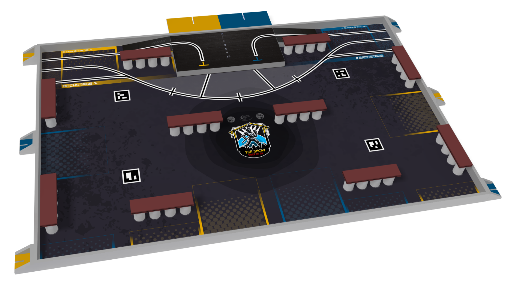

# Fat BOTtomed Girls (FBG) - 2025 Eurobot Project

[](https://github.com/NJurquet/FBG/actions/workflows/big_bot_tests.yml)
[](https://codecov.io/gh/NJurquet/FBG)

## Overview

**[Eurobot](https://www.eurobot.org/eurobot-contest/)** is an international robotics competition created in France.
The main goal of this event is to encourage youth to practice robotics with fun, by offering them an unforgettable technical and human experience.

Each year, a new theme is defined and the rules are adapted accordingly, with original actions to perform and a **100% self-made robot to build**.
Robots have to be **autonomous** and must be able to perform various tasks on a playing field in a limited amount of time to gather points.
2 teams play against each other by earning as much points as possible.
Aside from the main robot, teams can build SIMAs (Small Independent Mobile Actuator), which are small autonomous robots only living during the last 15 seconds of the match.

Project management, task sharing, autonomy, team spirit and experimentation are the core values to achieve one’s project and be ready to compete on the D-Day.

The Belgian competition was held in **Mons** and hosted by **[SparkOH!](https://sparkoh.be/projet-robotixs/robotixs/)** on April 19-20, 2025.

### Theme

The 2025 theme is **The Show Must Go On!**:

> This year the robots want to do even more competitions, more matches for more fun, but this comes with a cost.
> And in order to raise the necessary funds, some big charity concerts are planned: the Robot-Rock-Tour!
> But putting on a show is a lot of work and that’s why the robots are working extra hard to finish the preparations as quickly as possible, so that the show can take place on time.



### Points

To score points, the main robot can perform the following actions:

-   **ENSURE THE PROMOTION OF THE SHOW [20 pts]**: Deploy a banner in front of the playground table.
-   **PREPARE THE CONCERT HALL**: Build tribunes of different levels (represented by 1 plank and 2 cans).
    -   [4 pts] per level 1 tribune.
    -   [8 pts] per level 2 tribune.
    -   [16 pts] per level 3 tribune.
-   **STORE TOOLS [10 pts]**: Being in the finishing area at the end of the match.
-   **ESTIMATE THE ENTRIES**: Bonus points earned by displaying an estimated score. The lower the difference between the estimated score and the real score (not counting SIMA score), the more points are earned:

    `Bonus = min(20 points - Delta/2, score done)`

SIMAs can perform the following actions:

-   [5 pts] The superstar is valid on stage at the end of the match.
-   [0, 1, 2, 3, 5, 9 or 15 pts] The superstar is close to the stage edge at the end of the match.
-   [5 pts] For each of the 3 areas of the pit occupied by at least one team groupie at the end of the match.
-   [10 pts] All SIMAs make the party (moving actuator).

## Outcome

### Qualification Round

30 teams participated in the Belgian competition, 15 being from Belgium and 15 from other countries.
The other 15 were from France and Switzerland as guests such that they can test their robots before their national competitions.

The qualification round consist of playing 4 matches against any of the teams and collecting as much cumulative points as possible.

Our team finished **4th out of the 15 Belgian teams** and **7th out of the 30 teams**.
| General Ranking | Belgian Ranking | Team Name | Team Origin | Score |
|-----------------|-----------------|--------------------|------------------|-------|
| 1 | - | Les Karibous | France | 312 |
| 2 | 1 | UCLouvain- Bot save the queen | Belgium | 307 |
| 3 | - | SUDRIABOTIK | France | 304 |
| 4 | 2 | Gramme'N Roll | Belgium | 285 |
| 5 | - | Goldorak | France | 244 |
| 6 | 3 | UCLouvain - WaltiBot | Belgium | 239 |
| **7** | **4** | **ECAM - Fat BOTtomed Girl** | **Belgium** | **238** |
| 7 | - | Coffee Machine | France | 238 |
| 9 | 5 | MonSymphony | Belgium | 235 |
| 10 | 6 | Galil'HELHa | Belgium | 180 |
| 11 | - | Robot ESEO | France | 163 |
| 12 | - | Cybernétique en Nord | France | 158 |
| 13 | - | Evolutek | France | 132 |
| 14 | - | CRENIM | France | 130 |
| 15 | 7 | ECAM - Freddie Carte Mercurie | Belgium | 124 |
| 16 | 8 | Starbot | Belgium | 118 |
| 17 | 9 | ECAM - Johnny Wall-EDay | Belgium | 99 |
| 18 | 10 | ECAM - Daft Bot's | Belgium | 92 |
| 19 | - | RTFM | Switzerland | 73 |
| 20 | - | PM-ROBOTIX | France | 71 |
| 21 | 11 | PAGACH IESN | Belgium | 50 |
| 22 | 12 | UCLouvain - Juke Bot | Belgium | 45 |
| 23 | 13 | UCLouvain - EltonBot | Belgium | 32 |
| 24 | - | TDS-Team Robotique 72 | France | 29 |
| 25 | - | E.S.C.Ro.C.S. | France | 28 |
| 26 | 14 | ECAM - Les Spice Bots | Belgium | 17 |
| 26 | 14 | UCLouvain - GOATBOT | Belgium | 17 |

### Final Round

Being in the top 8 Belgian teams, we made it to the quarter finals.
Our team faced the incredible work of **MonSymphony** who won the championship, ending our journey in the quarter finals.


## Project

The repository contains the code used for the SIMAs (Superstar & Groupies) in the [SIMA](./SIMA) folder and the code used for the main robot in the [BIG_BOT](./BIG_BOT) folder.

SIMAs were developed using simple `Arduino` components and coded in `C++`/`Arduino`.
The main robot was developed using a Raspberry Pi 4 to control most of the tasks, hardware, and robotic logic in `Python`.

## Installation

### Big Bot

> **Note**: It is assumed that you have a working Raspberry Pi with the OS already installed.

#### Setup & Run

1.  Clone the repository:

    ```bash
    git clone https://github.com/NJurquet/FBG.git
    cd FBG
    ```

2.  Install the Python dependencies:

    ```bash
    pip install -r requirements.txt
    ```

3.  Start the `pigpio` daemon:

    ```bash
    sudo pigpiod
    ```

4.  Run the main program:

    > Make sure every component is connected to the Raspberry Pi GPIO pins before running the program.

    ```bash
    python -m BIG_BOT.src.main --score SOME_SCORE --color YELLOW_OR_BLUE
    ```

    Replace `SOME_SCORE` with the estimated score you want to display on the LCD screen and `YELLOW_OR_BLUE` with the starting color of your robot (either `yellow` or `blue`).

    > The association between components and GPIO pins is defined in the `BIG_BOT/src/config.py` file, feel free to adapt the pins to your needs.

#### Configure Raspberry Pi as hotspot

If you want to use the Raspberry Pi as a hotspot, you will be able to access it remotely via SSH and VNC, and without the need to be connected to a Wi-Fi network (it will create its own access point).
It was especially useful during the competition for running the code on the robot remotely.

**Check [this video](https://youtu.be/TWvL2C95FEg?si=-2T3gCtMyU8DEhau) from Everyday Tech for the whole setup process and explanation.**

> [!NOTE]
> For simplicity and easy access, [RaspAP](https://raspap.com/) is used to configure the Raspberry Pi as a hotspot.
> It provides a web interface for easy configuration. For more details, visit the [RaspAP GitHub repository](https://github.com/RaspAP/raspap-webgui).
>
> If you want more control over the configuration, use `hostapd` and `dnsmasq` to set up the hotspot manually.

> [!IMPORTANT]  
> **To be able to connect the hotspot to a Wi-Fi network, you will need to have a USB Wi-Fi dongle / adapter** so the Raspberry can use its built-in Wi-Fi interface `wlan0` as the one to connect to the network and the one provided by the USB dongle `wlan1` as the hotspot.

Most of the steps are explained in the RaspAP documentation and GitHub.

1.  First, update RPi OS to its latest version, including the kernel and firmware, followed by a reboot.

    ```bash
    sudo apt-get update
    sudo apt-get full-upgrade
    sudo reboot
    ```

2.  Set the WiFi country where you plan to use the Raspberry in raspi-config's `Localisation Options`.

    ```bash
    sudo raspi-config
    ```

    > You can also enable SSH and VNC in the `Interfacing Options` menu.

3.  Install RaspAP:

    ```bash
    curl -sL https://install.raspap.com | bash
    ```

    > Note that several options to install with RaspAP will be proposed. We declined all of them as we did not need VPN, ad block or WireGuard, feel free to install them if you want.

4.  Reboot the Raspberry Pi.

    ```bash
    sudo reboot
    ```

You should now see a new Wi-Fi network called `raspi-webgui` in your available networks with this configuration:

-   **SSID**: raspi-webgui
-   **Password**: ChangeMe
-   **IP address**: 10.3.141.1
-   **DHCP range**: 10.3.141.50 — 10.3.141.254

Now you can plug the USB Wi-Fi dongle into the Raspberry Pi and check if it is recognized by the system:

```bash
lsusb
```

> [!NOTE]
> You might need to install the driver for your USB Wi-Fi dongle if it is not recognized by the system.
> Check the manufacturer's website for the driver and installation instructions.
> The best is to use a Linux compatible USB Wi-Fi dongle so this process can be skipped.

You should see the new WLAN interface `wlan1` not connected to anything and the `wlan0` used for the hotspot with:

```bash
ifconfig
```

The admin web interface can be accessed by entering the Raspberry IP address `10.3.141.1` or using its hostname `raspberrypi.local` in your web browser.
The default credentials are:

-   **Username**: admin
-   **Password**: secret

Make sure to change the default SSID and password in the `Basic` & `Security` tabs of the hotspot web interface, as well as the country code in the `Advanced` tab to the one set with `raspi-config`.

Then, in the `RaspAP` web interface, go to the `Hotspot` tab and change the interface from `wlan0` to `wlan1`, then click on `Save`.

In the Raspberry terminal, modify the `/etc/dhcpcd.conf` file by removing the the `wlan0` part so that it only uses the `wlan1` interface for the hotspot (the IP address assigned to the new `wlan1` is `10.9.141.1`):

```bash
sudo nano /etc/dhcpcd.conf
```

And remove the previous network preconfigurations with:

```bash
sudo rm /etc/NetworkManager/system-connections/preconfigured.nmconnection
sudo reboot
```

Now connect to the new hotspot and you should be able to access the web interface with correct WLANs.
Go to the `Wi-Fi client` tab to connect the `wlan0` interface to a Wi-Fi network.

> [!TIP]
> If you encounter connection or interface issues, try restarting the hotspot in the `Hotspot` tab.

### SIMA

1.  Install the Arduino IDE from the official website: [Arduino IDE](https://www.arduino.cc/en/software).

2.  Open the Arduino IDE and install the required libraries for the SIMA code:

    -   `Servo`: [link](https://docs.arduino.cc/libraries/servo/)
    -   `Adafruit Motor Shield V2 Library`: [link](https://github.com/adafruit/Adafruit_Motor_Shield_V2_Library)

3.  Adapt the pins and `groupie` & `topStartLine` configuration constants in the `SIMA/SIMA/SIMA.ino` file to your SIMA, then upload the code to your Arduino board.

    ```cpp
    // CONFIGURATION CONSTANTS ///////////////////////
    const bool groupie = true;
    const bool leftStart = digitalRead(startLeftPin);
    const bool topStartLine = false;
    const int zoneNumber = topStartLine ? 1 : 2;
    //////////////////////////////////////////////////
    ```

## License

This project is licensed under the MIT License.
